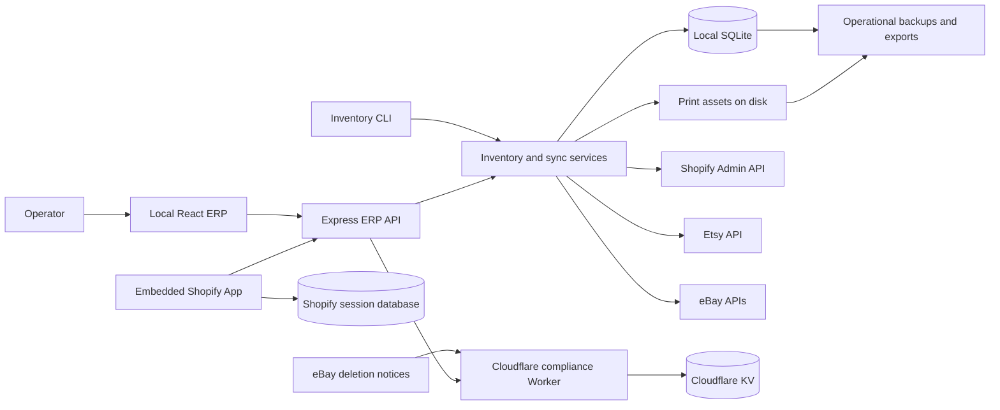
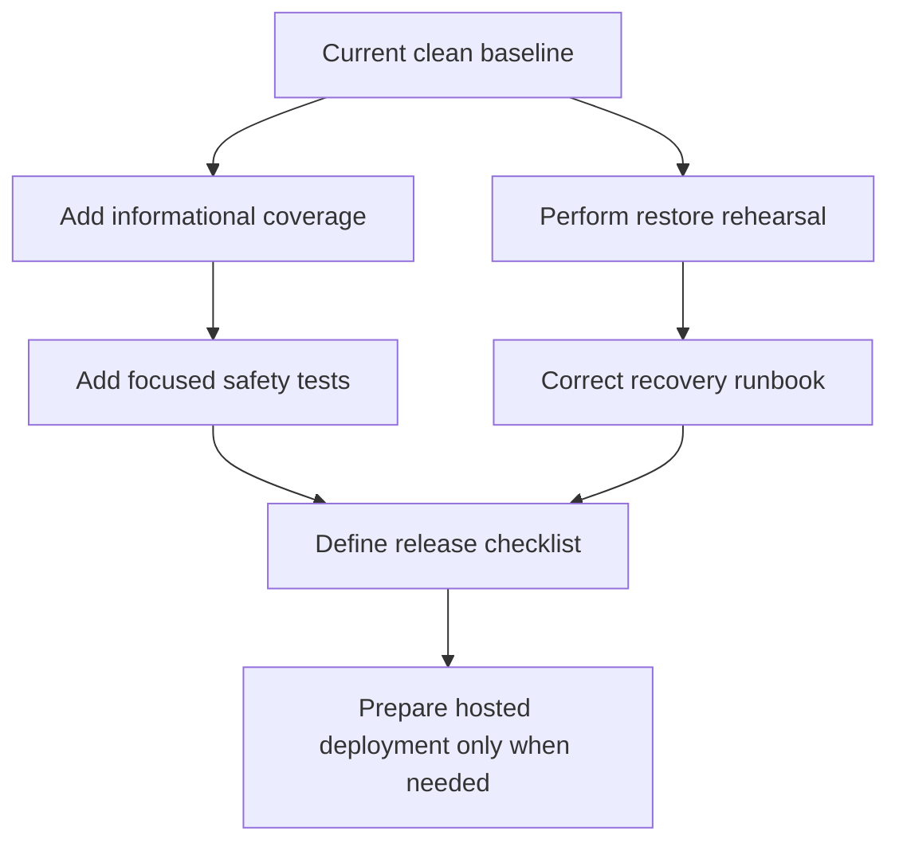

# Historical Application Audit Report

> This completed audit is retained for historical context. For current architecture, operations, marketplace safety, and active work, use `ARCHITECTURE.md`, `OPERATIONS.md`, `MARKETPLACES.md`, and `../PLAN.md`. Statements below describe the repository at the audit date and may no longer represent current behavior.

**Project:** Josh's Mini ERP  
**Audit date:** 2026-07-10  
**Scope:** Documentation, architecture, developer workflow, testing, security, marketplace safety, deployment readiness, and repository hygiene

## Executive Summary

Josh's Mini ERP is on a sound technical path. It has a useful local-first architecture, meaningful automated tests, strong marketplace safety rules, and clear separation between the local ERP, embedded Shopify app, and eBay compliance Worker.

The audit found no critical issue requiring development to stop. The main weakness was maintainability: important guidance existed, but it was concentrated in very large files and many standards depended on a developer remembering to run the correct checks manually.

The first improvement pass reorganized the documentation, added governance files, introduced root linting and formatting checks, expanded the quality commands, and added GitHub Actions. It also removed real marketplace identifiers and temporary production-state notes from documentation.

| Area                 | Assessment             | Notes                                                                         |
| -------------------- | ---------------------- | ----------------------------------------------------------------------------- |
| Product direction    | Strong                 | The local-first personal-store scope is appropriate.                          |
| Architecture         | Strong                 | SQLite is the single supported ERP working database.                          |
| Inventory safety     | Strong                 | Baseline, reconcile, dry-run, and event-history behavior are tested.          |
| Marketplace safety   | Strong                 | Legacy eBay writes remain disabled and migrations are guarded.                |
| Automated testing    | Good                   | Core safety scenarios are tested; coverage reporting is pending.              |
| Security posture     | Good                   | Secrets/local data are ignored and production API authentication is enforced. |
| Documentation        | Strong after cleanup   | Guidance is separated by audience and purpose.                                |
| Developer automation | Strong after cleanup   | Lint, formatting, CI, UI smoke, and Worker checks are available.              |
| Operational recovery | Good, not fully proven | Backup inspection exists; a dated restore rehearsal is recommended.           |

## System Overview



### Component responsibilities

| Component                | Responsibility                                                              |
| ------------------------ | --------------------------------------------------------------------------- |
| Local React ERP          | Daily inventory, printing, review, and configuration interface              |
| Express ERP API          | Business operations, validation, reports, storage, and authentication       |
| CLI                      | Maintenance, imports, exports, backups, mapping, OAuth, reconcile, and sync |
| SQLite database          | Normal local inventory and operational source of truth                      |
| Embedded Shopify app     | Shopify Admin surface that calls the ERP API                                |
| Shopify session database | OAuth/session persistence, separate from ERP inventory                      |
| eBay deletion Worker     | Compliance endpoint and protected deletion-notice feed                      |

## Product and Architecture Findings

### Local-first design

The application correctly treats SQLite at `data/inventory.sqlite` as the normal local database. This suits a single-user personal-store ERP because it provides transactional SQL storage without Docker, a local database server, or recurring cloud costs.

JSON remains available for portability, export, backup, and migration. It is not treated as a second working database. The unused root PostgreSQL path was removed, and inventory, printing metadata, reviews, and sales now share one coordinated SQLite database.

### Inventory ownership

The local ERP is the inventory source of truth. Marketplace quantities are observations and synchronization targets.

Important safety properties already exist:

- Local adjustments create inventory history events.
- New marketplace mappings establish a baseline before deductions or pushes.
- Reconcile and dry-run operations preview changes before live sync.
- Failed pulls do not cause stale local quantities to be pushed.
- Failed pushes do not cause the same marketplace sale to be deducted repeatedly.
- Marketplace sales can consume mapped instruction inventory.

These scenarios are more important than a raw coverage percentage because they protect real inventory.

### Marketplace boundaries

Shopify, Etsy, and eBay integrations are separated into adapters and helper workflows. The strongest safety boundary concerns legacy eBay listings:

- Read-only listing scans are allowed.
- Exact-match mapping apply changes only local ERP data.
- Live legacy quantity writes remain disabled by default.
- Inventory API migration requires one exact listing confirmation.
- Bulk migration, revision, ending, relisting, and recreation require an explicit reviewed plan.

This boundary should remain prominent in code review, documentation, and future AI-assisted work.

## What Was Already Strong

Before the cleanup, the repository already had several professional practices:

- Strict TypeScript configuration
- Shared storage contracts for SQLite and JSON migration compatibility
- Tests for inventory, imports, sync, backup, migration, reporting, printing, and mapping safety
- Production startup failure when `ERP_API_TOKEN` is missing
- Git ignores for `.env`, `data/`, build output, dependencies, and development logs
- A UI style guide focused on operational clarity
- AI-agent rules covering secrets, storage, verification, and eBay writes
- UI smoke screenshots for desktop and mobile review
- A Worker smoke test for eBay account-deletion compliance
- Dependency audit scripts for both npm projects

## Problems Identified

### Documentation sprawl

The old root README combined the quick start, CLI reference, operator manual, credentials, OAuth, deployment, recovery, and architecture. The old plan mixed active work with completed history, schema references, procedures, and production-state notes.

This made two basic questions unnecessarily difficult:

1. How do I safely use or develop the application?
2. What should be worked on next?

### Manual quality enforcement

The repository had build and test commands but no GitHub Actions workflow. Root code did not have lint enforcement, formatting was not checked, and the aggregate check did not cover every component.

### Generic component documentation

The Shopify app used mostly generic template documentation. It did not clearly explain that the root ERP owns inventory and that the Shopify app is an authenticated ERP client.

### Governance gaps

The package declared an ISC license, but no root license file existed. There was no root contribution guide, security policy, or project changelog.

### Operational details in permanent documentation

The old plan included temporary production connection state and real marketplace examples. These were not passwords, but permanent documentation should use fictional examples and avoid recording live state.

### Lint findings

Introducing linting found one unstable React hook dependency expression in the Shopify review page and several unused declarations. They were cleaned up without changing application behavior.

## Changes Made

### Documentation structure

The root README is now a concise front door with quick start, essential safety rules, common commands, data locations, and links to focused documentation.

| File                      | Purpose                                                          |
| ------------------------- | ---------------------------------------------------------------- |
| `docs/DEVELOPMENT.md`     | Setup, scripts, layout, environment, and change workflow         |
| `docs/ARCHITECTURE.md`    | Storage, inventory ownership, sync, and system boundaries        |
| `docs/OPERATIONS.md`      | Daily commands, imports, exports, backup, restore, and scheduler |
| `docs/MARKETPLACES.md`    | Shopify, Etsy, eBay, OAuth, mapping, and write safety            |
| `docs/DEPLOYMENT.md`      | Hosted architecture, secrets, deployment, and smoke checks       |
| `docs/TESTING.md`         | Verification matrix, service boundaries, and critical coverage   |
| `docs/TROUBLESHOOTING.md` | Startup, SQLite, credentials, sync, Shopify, eBay, and UI help   |

`PLAN.md` now focuses on current direction, current baseline, active work, protected eBay work, and the definition of done.

The Shopify README was rewritten around this project's architecture and safety boundaries. Worker documentation was cleaned up to avoid presenting a production endpoint as a reusable example.

### Governance and repository guidance

Added:

- `CONTRIBUTING.md`
- `SECURITY.md`
- `CHANGELOG.md`
- `LICENSE`
- `.editorconfig`
- `.nvmrc`
- Scoped `AGENTS.md` files for the Shopify app and compliance Worker

The root `AGENTS.md` verification matrix now includes formatting, Shopify lint/typecheck, Worker checks, and UI checks.

### Code quality tooling

Root ESLint and Prettier configuration were added. The primary commands now have clear responsibilities:

```text
npm run check          Formatting, lint, build, tests, Shopify typecheck and lint
npm run check:worker   eBay compliance Worker smoke test
npm run check:ui       Browser UI smoke test against a running application
npm run check:all      Complete local confidence suite
npm run audit:all      Root and Shopify dependency vulnerability audits
```

The Shopify app keeps its compatible ESLint configuration and uses a small cross-platform launcher so the root flat ESLint configuration does not leak into the subproject.

### Continuous integration

`.github/workflows/ci.yml` now runs on pull requests and pushes to `main`:

1. Install the pinned Node version.
2. Install root and Shopify dependencies with `npm ci`.
3. Run deterministic quality checks.
4. Run the Worker smoke test.
5. Install Playwright Chromium.
6. Start the built local application.
7. Run UI smoke tests.
8. Upload screenshots when the workflow fails.

A separate scheduled dependency-audit workflow was added. Audits are separated from deterministic PR checks because registry or advisory-service availability should not make ordinary validation unreliable.

## Verification Results

| Verification                        | Result                     |
| ----------------------------------- | -------------------------- |
| Root formatting check               | Passed                     |
| Root ESLint                         | Passed with zero warnings  |
| Root TypeScript and Vite build      | Passed                     |
| Root automated tests                | 37 passed                  |
| Shopify typecheck                   | Passed                     |
| Shopify lint                        | Passed with zero warnings  |
| UI smoke test                       | Passed                     |
| eBay compliance Worker smoke test   | Passed                     |
| Root dependency audit               | Zero known vulnerabilities |
| Shopify dependency audit            | Zero known vulnerabilities |
| Root and Shopify `npm ci --dry-run` | Passed                     |
| Markdown relative-link check        | Passed                     |
| `git diff --check`                  | Passed                     |

The improvement was committed and pushed to `main` as:

```text
2da647f Improve documentation and repository quality checks
```

## Post-Audit Marketplace Review Expansion

After the initial audit, Marketplace Reviews was expanded to include Etsy through the official Etsy Open API rather than scraping. Etsy explicitly prohibits screen scraping and provides a shop review endpoint with exact ratings, review text, listing/transaction identifiers, timestamps, and `image_url_fullxfull`.

The implementation now:

- Imports all paginated Etsy shop reviews and deduplicates incrementally.
- Reuses the existing feedback SQLite tables with `platform=ebay|etsy`.
- Preserves Etsy review photo URLs for local viewing and Judge.me CSV export.
- Matches Etsy listing IDs to local inventory mappings when available.
- Filters the local review table by eBay, Etsy, or both.
- Includes `source_platform` and `picture_urls` in the Judge.me-oriented export.
- Includes Etsy negative reviews and photos in Review Center and operational CSV reports.
- Stores rating-only Etsy reviews locally but excludes them from Judge.me CSV because Judge.me requires review text.

eBay review collection now also uses the official authenticated Feedback API. The browser scraper was removed after the API schema confirmed support for stable feedback/buyer/listing identifiers, comments, dates, pagination, and review image URLs.

## Current Risks and Limitations

### Restore is documented but not recently rehearsed

The app creates manifest-backed operational backups and can inspect them without restoring. A real recovery rehearsal using a disposable copy is still needed.

Record the rehearsal date, manifest, record counts, asset/history verification, reconcile result, and documentation corrections. Do not record credentials or private customer/marketplace data.

### Coverage reporting is not configured

The tests cover important scenarios, but the repository does not produce a coverage report. Coverage should initially be informational rather than enforced by an arbitrary percentage.

Use it to find missing safety scenarios in:

- Authentication and API route validation
- Scheduler startup and failure handling
- Marketplace adapter error translation
- Backup failure and partial-file scenarios
- Shopify server-route behavior

Do not create a database service merely to make the optional check pass during normal local work.

### Production operations still require judgment

Automated checks cannot prove that a live marketplace write is appropriate. Backups, previews, SKU review, baselines, and explicit approval remain necessary.

## Prioritized Roadmap



### Priority 1: Recovery confidence

1. Create a fresh operational backup.
2. Run `restore-dry-run` against its manifest.
3. Restore into a disposable directory or test environment.
4. Verify inventory, print assets, and feedback history.
5. Reconcile without live pushes.
6. Record results and update operations/troubleshooting guidance.

### Priority 2: Test visibility

1. Add an informational coverage command and CI artifact.
2. Review uncovered safety-critical branches.
3. Add tests where failure could corrupt counts, repeat deductions, expose data, or broaden writes.
4. Do not chase coverage in low-risk code solely to improve a percentage.

### Priority 3: Release process

Create a short checklist covering a clean worktree, `check:all`, dependency audits, backup inspection, changelog, migrations, production environment, post-deployment health/reconcile, and rollback.

### Priority 4: Credential rotation

At the next rotation, document the actual revocation, replacement, ignored local storage, Secret Manager update, redeployment, connection-test, and reconcile-before-sync process.

### Priority 5: Architecture decisions

Add a short record under `docs/adr/` only when making a durable decision, such as changing local storage, marketplace write ownership, hosted deployment targets, or token storage.

## Developer Checklist

Before starting:

- Read `AGENTS.md` and task-specific documentation.
- Check `git status` and preserve unrelated work.
- Determine whether the task is local-only, marketplace-reading, or marketplace-writing.
- Back up before bulk, migration, credential, or mapping work.

Before finishing:

- Add focused tests for behavior changes.
- Run the matrix from `docs/TESTING.md`.
- Review the diff for secrets and files under `data/`.
- Preserve SQLite as the normal local path unless architecture is explicitly changing.
- Preserve legacy eBay write boundaries.
- Update one canonical document rather than duplicating guidance.
- Record commands run and checks skipped.

## Final Assessment

This is not a careless codebase. It has mature qualities: explicit safety boundaries, tested inventory behavior, local-first cost awareness, operational history, backup tooling, and separation of concerns.

The next step is not a rewrite. Continue strengthening proof and repeatability around the existing design:

1. Rehearse recovery.
2. Use coverage to locate meaningful safety gaps.
3. Keep CI green.
4. Preserve marketplace write safeguards.
5. Add infrastructure only when the personal-store workflow genuinely requires it.

That approach keeps the project clean, understandable, inexpensive, and increasingly reliable without replacing working systems for novelty.
